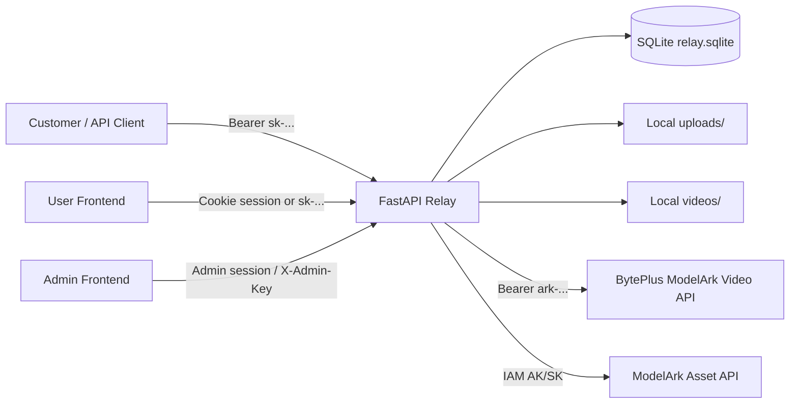
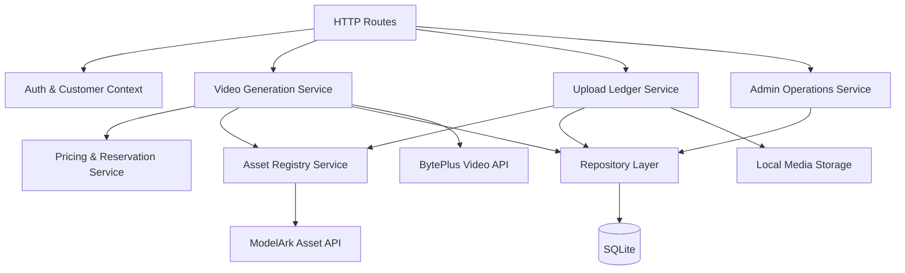
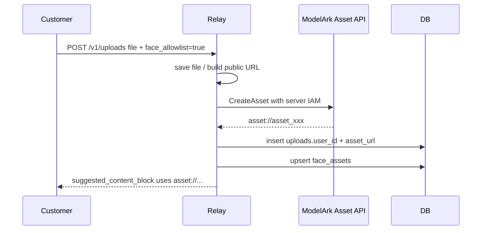
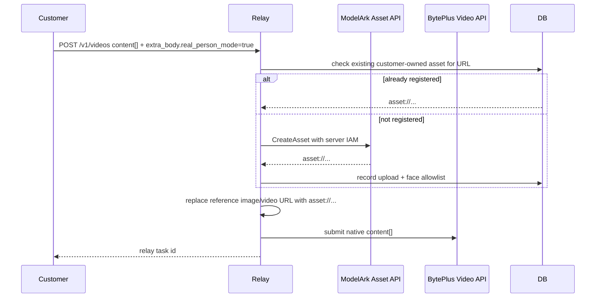

# Alpha1 New Version Architecture Plan

> Status: design only. Do not implement until the owner confirms the scope.

**Goal:** turn the current Seedance Relay into a clearer alpha1 architecture that keeps BytePlus-native video requests, adds reliable self-service asset/face allowlist flows, and gives admins stronger control over customers, pricing, limits, and material visibility.

**Architecture:** keep a modular monolith in FastAPI for alpha1, but split responsibilities into explicit service boundaries before any larger rewrite. Customer-facing API keys remain separate from upstream Ark generation keys and server-side IAM AK/SK used for ModelArk asset registration.

**Tech Stack:** FastAPI, SQLite for alpha1, local uploaded media storage, BytePlus ModelArk video generation API, ModelArk asset registration via server IAM AK/SK, Vue/Element Plus static frontend.

---

## 1. Alpha1 Scope

Alpha1 is a design and cleanup milestone, not a product rewrite. The current system already supports the main business path:

- Customers call the Relay API with `sk-...`.
- Relay submits video generation using either the platform `UPSTREAM_API_KEY` or a customer-level `users.byteplus_api_key`.
- Relay uses server-only IAM `BYTEPLUS_ACCESS_KEY_ID` / `BYTEPLUS_ACCESS_KEY_SECRET` for asset registration.
- Customer uploads are written to `uploads.user_id`; customers can only list and use their own materials.
- Admin can view customers, tasks, pricing markup, uploads, and face assets.

Alpha1 should preserve this behavior and improve the internal shape around it. The new version should focus on small but important details: clearer module boundaries, safer credential ownership, better asset registration status, per-customer pricing and limit controls, and a user guide that mirrors native BytePlus request bodies.

## 2. Non-Goals

Do not introduce a new GeekAI-style parameter system. The only Relay-specific convenience switch should remain:

```json
{
  "extra_body": { "real_person_mode": true }
}
```

Do not require customers to own or provide IAM AK/SK. Customers should only need their Relay API key and, optionally, their own Ark generation API key if the admin chooses to bind one to that customer.

Do not migrate to microservices in alpha1. The project is still small enough that a modular monolith is easier to operate, test, deploy, and debug.

Do not store server IAM secrets in the customer table. They should live in server environment variables or a future secret manager.

## 3. Current Architecture Summary



Current important tables:

| Table | Purpose |
|---|---|
| `users` | Customer account, Relay API key, balance, admin flag, optional customer Ark key, markup |
| `tasks` | Video jobs, upstream task IDs, held/actual cost, status, local video path |
| `uploads` | Customer-owned material ledger, public URL, asset URL/status, face allowlist fields |
| `face_assets` | Server allowlist of approved `asset://...` material |
| `sessions` | Browser login sessions |
| `settings` | Runtime cached values such as auto-created asset group ID |

## 4. Alpha1 Target Architecture

Keep one deployable app, but organize the business logic into these internal modules:



Recommended module boundaries:

| Module | Responsibility |
|---|---|
| `config.py` | environment parsing, feature flags, non-secret status reporting |
| `db.py` | connection, schema migrations, row helpers |
| `auth.py` | API key auth, session auth, admin auth |
| `services/video.py` | native `content[]` validation, upstream submit/sync/cancel |
| `services/assets.py` | ModelArk asset group, create asset, wait status, ownership checks |
| `services/uploads.py` | local upload, from-url registration, upload response shaping |
| `services/pricing.py` | estimate, reserve, settle, customer markup snapshot |
| `services/admin.py` | customer creation/update, dashboard metrics, material inspection |
| `routers/*.py` | thin route handlers only |

This does not need to be fully split in one commit. Alpha1 should define the shape first, then execute in small steps after confirmation.

## 5. Key Separation Design

There are three credential classes, and alpha1 must keep them separate:

| Credential | Owner | Stored Where | Used For | Customer Visible |
|---|---|---|---|---|
| Relay API key `sk-...` | Customer | `users.api_key` | Call Relay `/v1/*` | Yes |
| Ark generation key `ark-...` | Platform or customer | `UPSTREAM_API_KEY` or `users.byteplus_api_key` | Submit `/v1/videos` upstream | Optional admin-visible |
| IAM AK/SK | Platform server | Environment or secret manager | Create asset group / create `asset://...` | No |

Alpha1 admin UI should label these as separate boxes:

- Customer API key: what the customer uses.
- Generation key: optional per-customer upstream billing key.
- Asset registry IAM: server-only, shared infrastructure credential.

`/admin/config` should continue to return only booleans such as `configured: true`, never raw AK/SK or group IDs unless explicitly safe and masked.

## 6. Asset And Face Allowlist Flow

Alpha1 should support two customer paths.

### Path A: explicit upload first



### Path B: one-line generation switch



Detail optimizations for alpha1:

- Add a material registration state model: `pending`, `created`, `active`, `failed`.
- Store upstream error text for failed asset registration in `uploads.asset_error`.
- Add a dedupe key based on `user_id + url + purpose + face_allowlist` so repeated generation requests reuse the same asset.
- Keep `asset://...` ownership enforcement: a customer cannot use another customer's asset.
- Admin should be able to filter uploads by customer, material type, asset status, and face allowlist status.

## 7. API Surface

Keep the customer API native and simple.

### Customer APIs

| Endpoint | Alpha1 Role |
|---|---|
| `POST /v1/videos` | Submit native `content[]`; optionally use `extra_body.real_person_mode=true` |
| `POST /v1/videos/estimate` | Estimate using current customer markup and model pricing |
| `GET /v1/videos` | List current customer's tasks |
| `GET /v1/videos/{id}` | Sync and return current customer's task |
| `GET /v1/videos/{id}/content` | Download current customer's video |
| `POST /v1/uploads` | Upload local material and optionally register allowlist asset |
| `POST /v1/uploads/from-url` | Register an existing public URL and optionally register allowlist asset |
| `GET /v1/uploads` | List only current customer's materials |
| `GET /v1/uploads/{id}` | Read only current customer's material |
| `GET /v1/pricing` | Return effective customer pricing |
| `GET /v1/models` | Return models enabled for this Relay/customer |

### Admin APIs

| Endpoint | Alpha1 Role |
|---|---|
| `GET /admin/config` | Show non-secret status for upstream key, IAM, asset group, feature flags |
| `GET /admin/uploads` | Full platform material ledger with filters |
| `GET /admin/uploads/{id}` | Material detail and troubleshooting fields |
| `GET /admin/face-assets` | Server allowlist registry |
| `POST /admin/face-assets` | Manual allowlist upsert |
| `GET /admin/users` | Customer list with pricing/limit summary |
| `GET /admin/users/{id}` | Customer detail, recent tasks, recent uploads |
| `POST /admin/users` | Create customer, issue Relay API key |
| `PATCH /admin/users/{id}` | Update status, balance, markup, optional generation key, limits |

## 8. Pricing And Limit Controls

The current `markup_pct` model is a good alpha1 base. The next design should add explicit customer plan fields, while keeping current behavior as fallback.

Proposed new fields:

| Field | Purpose |
|---|---|
| `users.markup_pct` | Existing customer price multiplier |
| `users.monthly_budget_usd` | Optional monthly spend cap |
| `users.rpm_limit` | Optional request-per-minute limit |
| `users.concurrency_limit` | Optional active task limit |
| `users.enabled_models` | Optional allowlist of model IDs |
| `users.nsfw_enabled` | Whether NSFW models appear in `/v1/models` |

Alpha1 pricing behavior:

1. On estimate, calculate effective cost from model pricing + customer markup.
2. On task creation, snapshot markup and estimated hold into `tasks`.
3. On settlement, use actual upstream usage when available.
4. Admin price edits affect future tasks only, not historical tasks.
5. NSFW model pricing can be represented as normal model pricing with a model-level override.

## 9. Frontend Plan

### User Frontend

User pages should stay operational, not marketing-style:

- New video page: native JSON editor, model selector, estimate panel, submit.
- Materials page: upload, from-url registration, face allowlist toggle, material cards, copy `asset://` or content block.
- Tasks page: list, status, download.
- API guide page: native examples for text, image, first/last frame, multi-image, video ref, audio, real person mode, and NSFW model.
- Account page: key, balance, effective pricing, limits.

### Admin Frontend

Admin pages should focus on operations:

- Overview: active customers, held balance, revenue, upstream cost, uploads, failed assets.
- Customers: search, create, top up, per-customer markup, optional generation key, enabled models, limits.
- Materials: cross-customer ledger, filters, asset status, face allowlist status, retry failed registration.
- Pricing: model pricing table and customer markup preview.
- Config: IAM status, upstream key status, feature flags, no secret values.
- API docs: mounted markdown and examples.

## 10. Data Model Changes For Execution Phase

These are proposed for later execution, not for this design-only commit.

```sql
ALTER TABLE uploads ADD COLUMN asset_error TEXT;
ALTER TABLE uploads ADD COLUMN asset_registered_at INTEGER;
ALTER TABLE uploads ADD COLUMN source_hash TEXT;
CREATE UNIQUE INDEX IF NOT EXISTS idx_uploads_user_source
  ON uploads(user_id, source_hash, purpose);

ALTER TABLE users ADD COLUMN monthly_budget_usd REAL;
ALTER TABLE users ADD COLUMN rpm_limit INTEGER;
ALTER TABLE users ADD COLUMN concurrency_limit INTEGER;
ALTER TABLE users ADD COLUMN enabled_models TEXT;
ALTER TABLE users ADD COLUMN nsfw_enabled INTEGER NOT NULL DEFAULT 0;

CREATE TABLE IF NOT EXISTS audit_events (
    id TEXT PRIMARY KEY,
    actor_user_id TEXT,
    actor_type TEXT NOT NULL,
    action TEXT NOT NULL,
    target_type TEXT,
    target_id TEXT,
    metadata_json TEXT,
    created_at INTEGER NOT NULL
);
```

`source_hash` should be derived from stable material identity, for example `sha256(user_id + purpose + normalized_url)`. For local uploads, use the public URL after storage or a file hash if inexpensive.

## 11. Error Handling

Alpha1 should make customer errors direct and admin errors diagnosable.

| Error Code | Customer Meaning | Admin Follow-Up |
|---|---|---|
| `asset_registry_not_configured` | Self-service asset registration is unavailable | Configure IAM AK/SK and asset group |
| `face_asset_self_service_disabled` | `real_person_mode` is not enabled | Turn on `FACE_ASSET_SELF_SERVICE` |
| `asset_registration_failed` | Relay could not register the material | Inspect `uploads.asset_error`, retry |
| `asset_not_owned` | The `asset://` belongs to another account | Customer must use own upload |
| `model_not_enabled` | Customer cannot use that model | Enable model or choose another |
| `rate_limit_exceeded` | Customer exceeded RPM/concurrency | Admin can raise limits |
| `insufficient_balance` | Balance cannot cover held amount | Top up |

All upstream errors should continue to be sanitized before returning to customers.

## 12. Security And Secret Storage

Alpha1 should keep the current safe default:

- `.env.relay` is ignored and never committed.
- IAM AK/SK is server-only.
- `/admin/config` exposes only configured/not-configured status.
- Customer API keys are shown only when created or in the account page for that logged-in customer.
- Admin APIs require admin auth; script fallback `X-Admin-Key` remains for operations.

Future production option:

- Replace environment secrets with a secret manager.
- Store only a secret reference in app config, never the raw secret.
- Add audit logs for admin reads/updates of customer generation keys.

## 13. Testing Strategy

Current tests already cover uploads, customer pricing, asset ownership, self-service face flow, and asset group creation. Alpha1 execution should extend tests before changing implementation.

Required new tests:

- Customer model visibility respects `enabled_models` and `nsfw_enabled`.
- Customer RPM/concurrency rejects excess requests before upstream submission.
- Failed asset registration writes `uploads.asset_error`.
- Repeated `real_person_mode` with the same URL reuses existing customer-owned asset.
- Admin can filter uploads by asset status and face allowlist status.
- `/admin/config` still never leaks AK/SK or group ID.
- Pricing changes affect future tasks but not existing task snapshots.

Verification commands:

```bash
python -m py_compile relay_server.py create_asset_white_label.py
python -m unittest discover -s tests -p "test_*.py" -v
```

For frontend execution, use local screenshots for:

- User new video
- User materials
- User API guide
- Admin overview
- Admin customer detail
- Admin material ledger

## 14. Execution Phases After Confirmation

### Phase 1: Architecture cleanup without behavior change

- Extract config, db helpers, auth helpers, upload helpers, asset helpers, and pricing helpers.
- Keep route responses unchanged.
- Run full tests after each extraction.

### Phase 2: Asset registration reliability

- Add asset status/error fields.
- Add dedupe for repeated customer material registration.
- Add retry endpoint for admin material registration.
- Improve admin material detail.

### Phase 3: Customer pricing and limits

- Add customer model allowlist, NSFW enable flag, RPM, concurrency, monthly budget.
- Add tests for model visibility and limit enforcement.
- Add admin UI controls.

### Phase 4: User guide and client ergonomics

- Keep native `/v1/videos` examples.
- Add copy buttons for upload, from-url, real-person mode, and NSFW model examples.
- Add a compact command-line guide for customers who do not use the web UI.

### Phase 5: Production hardening

- Add audit events.
- Add optional secret manager adapter.
- Add storage cleanup/retention policy.
- Add scheduled task sync worker if polling-only becomes insufficient.

## 15. Open Decisions For Owner

Please confirm these before implementation:

1. Should alpha1 enable per-customer `enabled_models` and `nsfw_enabled`, or keep model access global for now?
2. Should RPM/concurrency limits be enforced in alpha1, or only designed and shown in admin first?
3. Should failed asset registration be retryable from admin UI in alpha1?
4. Should local uploads remain on disk for alpha1, or should object storage be planned before execution?
5. Should the frontend show customer Ark generation key status, or keep it admin-only?

## 16. Recommended Alpha1 Decision

Recommended path: execute phases 1, 2, and the smallest useful part of phase 3 first.

That gives the system better maintainability, fixes the most important self-service face/asset edge cases, and adds pricing/limit knobs without disrupting existing customers. Larger production hardening such as secret manager, object storage, and scheduled workers can wait until the core customer flow is stable.
