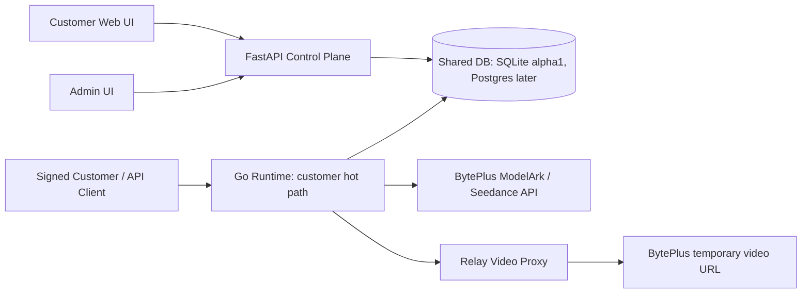

# Alpha1 Runtime Proxy And Customer Control SPEC

> Status: active execution SPEC after owner scope correction. Implementation is in progress; local automated evidence exists, while external deployment evidence is still required before marking alpha1 complete.

## 0. Owner Intent

This project is a white-label Seedance relay for signed customers. The Relay should help customers use the upstream BytePlus/Seedance capability as completely as possible, while hiding upstream credentials and upstream result URLs.

The Relay must not become an extra content-moderation layer. Content success or rejection should mostly follow the upstream BytePlus endpoint/profile behavior. Our own system should focus on customer account control, billing, model availability, API key security, auditability, and video delivery proxying.

## 1. Product Scope

### Must Build

- Admin can set each customer's direct consumption multiplier, for example `1.0`, `1.2`, `1.3`.
- Admin can set each customer's available model list.
- Model IDs default to the native BytePlus API `model id`; admin may optionally configure aliases for lower customer explanation cost, but aliasing is opt-in and never changes the default. 绠＄悊鍛樹富鍔ㄩ厤缃苟涓哄鎴峰惎鐢ㄥ埆鍚嶆椂锛屾墠鏀瑰彉瀹㈡埛鍙鐨勬ā鍨嬪悕绉帮紱鏈厤缃垨鏈粰璇ュ鎴峰惎鐢ㄥ埆鍚嶆椂锛屽鎴风湅鍒板拰鎻愪氦鐨勪粛鐒舵槸瀛楄妭鍘熺敓 `model id`銆?- Customer estimate, balance hold, and settlement use that customer's multiplier.
- Customer generation results are served through Relay-owned URLs.
- Generated videos are not permanently stored on the Relay server by default.
- BytePlus temporary video URLs are never exposed to customers.
- Customer can change their own login password.
- Customer can rotate/generate their own Relay API key.
- Admin can reset password and rotate customer Relay API key when needed.
- Go runtime handles the high-frequency customer API path when the Python behavior is frozen and verified.
- Security review means account/payment/key/call safety, not customer content censorship.

### Out Of Scope For Alpha1

- Public user registration.
- Email password recovery.
- OAuth, SSO, 2FA, organization/team permission system.
- Extra Relay-side content moderation or content classification.
- A separate admin switch named SFW/NSFW.
- A real-human authorization workflow inside this Relay.
- Permanent local storage for generated videos.
- Full rewrite of every admin/user page before the core runtime path is stable.

## 2. Implementation State Snapshot

Implementation state in the current worktree:

- `relay_server.py` owns auth, customers, pricing, uploads, asset registration, generation, task polling, video streaming, admin APIs, and static UI serving.
- Customer API key format is `sk-...`.
- Customer login uses email/password session cookies.
- Admin can create customers with generated temporary passwords.
- Admin can reset customer password and rotate customer Relay API key.
- Customer can change their own password.
- Customer can rotate their own Relay API key; the old key stops working immediately.
- New Relay API keys are shown once at creation or rotation; list/detail views show masked keys.
- Admin-provided customer passwords for create/reset must be at least 10 characters; omitted create passwords are server-generated.
- New pricing logic uses `price_multiplier`; legacy `markup_pct` remains only as a compatibility fallback.
- Admin can set `enabled_models` as default access, selected model IDs, or an explicit empty list.
- Model IDs default to native BytePlus API model IDs. Optional aliases are supported through `MODEL_ID_ALIASES_JSON`; aliases appear only when configured and explicitly enabled for that customer.
- Native model IDs in this SPEC and public docs were checked against current BytePlus ModelArk Seedance docs on 2026-06-04; future model changes must be updated from the upstream docs before release.
- `VIDEO_PERSIST_MODE=proxy_only` is the default; new successful tasks should not download MP4 files into `VIDEO_DIR`.
- `/v1/videos/{id}/content` streams through Relay and hides the upstream BytePlus video URL.
- Go runtime serves the selected customer hot paths; FastAPI remains the admin/auth/uploads/static control plane.

## 3. Target Architecture

Alpha1 should use a staged control-plane/runtime split.



### FastAPI Control Plane Keeps

- Admin UI and admin APIs.
- Login/session endpoints.
- Customer account page.
- Customer creation, balance, multiplier, model availability.
- Uploads and existing asset/face helper flow unless explicitly moved later.
- Static UI and docs.

### Go Runtime Moves First

- `POST /v1/videos/estimate`
- `POST /v1/videos`
- `GET /v1/videos/{id}`
- `GET /v1/videos/{id}/content`
- `GET /v1/models`

### Important Migration Boundary

Do not move `POST /v1/videos` to Go until current Python behavior is covered by tests. In particular, current `real_person_mode` materializes reference URLs into `asset://...` through server-side IAM. If that feature remains needed, Go must either implement it or call a private FastAPI helper before upstream submission.

## 4. Customer Consumption Multiplier

### Data Model

Add:

```sql
ALTER TABLE users ADD COLUMN price_multiplier REAL NOT NULL DEFAULT 1.0;
ALTER TABLE tasks ADD COLUMN price_multiplier REAL;
```

Migration:

```text
users.price_multiplier = 1.0 + users.markup_pct when markup_pct is not null
users.price_multiplier = 1.0 + MARKUP_PCT when markup_pct is null
tasks.price_multiplier = 1.0 + tasks.markup_pct when tasks.markup_pct is not null
```

`markup_pct` may remain during compatibility migration. New logic and UI should use `price_multiplier`.

### Behavior

- `1.0` means customer pays upstream cost as-is.
- `1.2` means customer pays 120% of upstream cost.
- `1.3` means customer pays 130% of upstream cost.
- Estimate: `customer_estimate = upstream_estimate * price_multiplier`.
- Balance hold: `customer_hold = upstream_max_cost * price_multiplier`.
- Task creation snapshots `price_multiplier` into the task row.
- Settlement uses the task snapshot, not the customer's latest multiplier.
- Admin multiplier changes affect future tasks only.

### Admin UI Wording

Use:

```text
娑堣垂绯绘暟 / Price Multiplier
```

Do not present this new setting as `markup_pct`.

## 5. Customer Model Availability

### Data Model

Add:

```sql
ALTER TABLE users ADD COLUMN enabled_models TEXT;
```

`enabled_models` is JSON text:

```json
["dreamina-seedance-2-0-260128", "dreamina-seedance-2-0-fast-260128", "seedance-1-0-lite-t2v-250428"]
```

`NULL` means use global default model list.

`[]` means explicitly no models are enabled for that customer.

### Behavior

- Unauthenticated `GET /v1/models` returns the public/default model list.
- Authenticated `GET /v1/models` returns only models enabled for that customer.
- Estimate rejects disabled models before price calculation.
- Create rejects disabled models before balance hold and before upstream submission.
- Admin can update model list per customer.
- Admin UI/API must preserve the difference between `NULL` default access and explicit empty-list access.
- Customer-facing model IDs are native BytePlus API model IDs by default.
- Admin may configure an optional alias map, for example `{"short-name":"dreamina-seedance-2-0-260128"}`. An alias is customer-visible only if the admin explicitly enables that alias in the customer's `enabled_models`; otherwise the customer sees and submits the native model ID. When a customer uses an alias, Relay forwards the native model ID upstream.
- Public docs and default UI examples must use native BytePlus API model IDs, not aliases. Aliases are an admin/customer-specific convenience, not the canonical documentation surface.
- Do not expose upstream URLs, upstream account labels, endpoint/profile names, filter settings, operator notes, or secret keys.
- NSFW/adult capability is represented as normal enabled model access in this list, not as a separate SFW/NSFW toggle.

## 6. BytePlus / Seedance Request Guardrails

This section is about preserving upstream compatibility, not restricting customer content.

### Native Request Shape

Keep the customer API close to BytePlus native video generation:

- `model`
- `content[]`
- `resolution`
- `ratio`
- `duration`
- `seed`
- `generate_audio`
- `watermark`
- upstream-compatible extra fields explicitly supported by the active model/profile.

Do not introduce a new GeekAI-style request shape.

### Model Registry

Replace raw `MODEL_MAP` use with a model registry. The default public `id` should be the native BytePlus API model ID:

```json
{
  "id": "dreamina-seedance-2-0-260128",
  "upstream_model_or_endpoint": "dreamina-seedance-2-0-260128",
  "profile": "standard",
  "enabled_by_default": true,
  "supports_audio": true,
  "supports_reference_image": true,
  "supports_reference_video": true,
  "supports_reference_audio": true,
  "max_reference_images": 9,
  "max_reference_videos": 3,
  "max_reference_audios": 3,
  "operator_notes": "not returned to customer"
}
```

Customer `/v1/models` returns only safe fields:

- `id`
- `description`
- supported ratios/resolutions/durations if useful
- high-level capability hints

It may return the native BytePlus API model ID in `id`. It must not expose upstream URLs, account labels, endpoint/profile names, filter settings, secret keys, or internal operator notes.

### Validation Purpose

Validation exists to avoid bad billing and avoid immediate upstream rejects. It is not a content policy engine.

Validate:

- unknown content block types,
- unsupported content roles,
- too many reference images/videos/audios for the selected model,
- audio-only requests when the upstream model requires image/video reference,
- unsupported resolution, ratio, duration, or audio settings.

Do not add Relay-side prompt/content censorship in alpha1.

## 7. Local NSFW Operating Notes

This section records operational facts from the local NSFW notes and BytePlus behavior. It does not create additional user content restrictions.

### Operating Facts To Preserve

- NSFW success depends on the upstream endpoint/profile, account status, and content filter configuration.
- API/SDK calls can behave differently from console/playground calls.
- Console/playground may apply default filtering.
- Some workflows depend on operator-side endpoint/profile setup.
- Some asset workflows depend on `asset://...` references and server-side asset registration behavior.
- Some upstream failures may happen after generation because output can be checked again.
- If audio causes upstream blocking or failure, customers/operators may need to adjust generation settings such as audio.
- `ASSET_AUTO_REGISTER_SKIP_MODERATION` is a server/operator setting, not a customer-facing button.

### Relay Policy

- Do not add a separate SFW/NSFW customer toggle.
- Do not block customer prompts on Relay side.
- Do not publish internal NSFW prompt recipes in public API docs or customer UI unless the owner explicitly asks for a customer-facing guide.
- Keep exact local NSFW examples, endpoint assumptions, and runbook notes in an operator-only file:

```text
docs/ops/nsfw-operator-runbook.md
```

- If a customer has a model enabled, Relay should pass valid native requests through to the configured upstream model/profile.
- If upstream blocks or fails, Relay records sanitized reason and request id for admin troubleshooting.
- Relay should not promise that every NSFW request will succeed, because upstream can still reject or fail.

## 8. Account Security And Self-Service Credentials

Security here means account/payment/key safety.

### Customer Password Change

Add:

```text
POST /auth/change-password
```

Request:

```json
{
  "current_password": "old-password",
  "new_password": "new-password"
}
```

Rules:

- Requires current password.
- Rejects same-as-current password.
- Minimum new password length: 10 characters.
- Revoke other active sessions after change.
- Return only `{ "ok": true }`.

### Customer Relay API Key Rotation

Add:

```text
POST /v1/me/api-key/rotate
```

Rules:

- Server generates the new `sk-...` key.
- Customer cannot type arbitrary key.
- New key is shown once.
- Old key is disabled immediately in alpha1.
- Customer UI warns before rotation.

Response:

```json
{
  "api_key": "sk_new_key",
  "shown_once": true,
  "previous_key_status": "disabled"
}
```

### Admin Credential Actions

Add:

```text
POST /admin/users/{user_id}/api-key/rotate
```

Keep:

```text
PATCH /admin/users/{user_id}
```

for password reset, balance, multiplier, model list, status, and upstream generation key.

### Credential Display

- Admin user list must not return full `api_key`.
- Admin user list must not return full `byteplus_api_key`.
- Admin user detail should show masked keys by default.
- Customer account page should show masked key metadata after rotation is implemented.
- New Relay API keys are shown once at creation or rotation.
- BytePlus `ark-...` keys are operator/admin-only and never customer-visible.

### Audit Events

Create an `audit_events` table:

```sql
CREATE TABLE IF NOT EXISTS audit_events (
    id TEXT PRIMARY KEY,
    actor_user_id TEXT,
    actor_type TEXT NOT NULL,
    action TEXT NOT NULL,
    target_type TEXT,
    target_id TEXT,
    metadata_json TEXT,
    created_at INTEGER NOT NULL
);
```

Audit:

- customer changed password,
- customer rotated Relay API key,
- admin reset password,
- admin rotated customer Relay API key,
- admin changed balance,
- admin changed price multiplier,
- admin changed enabled model list,
- admin changed upstream generation key.

Admin must be able to review these events through `GET /admin/audit-events` and the admin Audit tab. Audit metadata must stay secret-safe.

### Login Safety

Add:

```sql
ALTER TABLE users ADD COLUMN api_key_last_rotated_at INTEGER;
ALTER TABLE users ADD COLUMN password_changed_at INTEGER;
ALTER TABLE users ADD COLUMN failed_login_count INTEGER NOT NULL DEFAULT 0;
ALTER TABLE users ADD COLUMN locked_until INTEGER;
```

Rules:

- Rate-limit `/auth/login`.
- Temporarily lock account after repeated failed login attempts.
- Check `Origin` or CSRF token for cookie-authenticated state-changing routes.
- Treat any non-empty malformed or invalid `Authorization` header as a failed authentication attempt; do not fall back to session cookies or unauthenticated public responses.
- Never log passwords, Relay API keys, BytePlus keys, session tokens, signed video tokens, or upstream video URLs.

## 9. Video Delivery Proxy

The customer must receive Relay-owned URLs only.

### Forbidden

Do not use a plain `302` redirect to BytePlus `video_url`. That exposes the real BytePlus URL in browser/network/client logs.

### Required Flow

1. Customer calls `GET /v1/videos/{id}`.
2. Relay refreshes upstream task state.
3. If succeeded, Relay stores upstream `video_url` server-side only.
4. API returns:

```json
{
  "video_url": "https://video.customer-domain.com/v1/videos/vid_xxx/content"
}
```

5. `GET /v1/videos/{id}/content` verifies customer ownership.
6. Relay streams bytes from BytePlus to the customer.
7. Customer never receives upstream `video_url`.

### Browser Playback

The proxy must support:

- `GET`
- `HEAD`
- `Range`
- `206 Partial Content`
- `Content-Length`
- `Content-Range`
- correct `Content-Type`

Without Range support, browser playback and seeking may fail.

### Storage Policy

Add:

```text
VIDEO_PERSIST_MODE=proxy_only
```

Default:

```text
proxy_only
```

Rules:

- Do not call `_persist_video` for new successful tasks.
- Do not create new MP4 files under `VIDEO_DIR`.
- Keep old `local_video_path` read support for previous rows.
- Store upstream URL server-side only.
- Optional future cache must be opt-in, not default.

## 10. Database Boundary

SQLite is acceptable for local alpha1 if:

- WAL mode is enabled,
- write transactions are short,
- busy timeout is configured,
- only one Go runtime process writes,
- only one component owns settlement writes for a task.

Move to Postgres before production if:

- multiple runtime replicas are needed,
- customer traffic grows,
- admin/runtime writes conflict,
- audit-grade billing is required.

## 11. Execution Phases

### Phase 0: Freeze Current Behavior

Files:

- `relay_server.py`
- `tests/test_customer_pricing.py`
- `tests/test_alpha1_spec_controls.py`
- `tests/test_alpha1_live_smoke.py`

Tasks:

1. Add tests around current pricing snapshot behavior.
2. Add tests around current customer auth and API key behavior.
3. Add tests around current `/v1/models`.
4. Add tests proving current content endpoint does not return upstream URL in JSON.
5. Run:

```bash
python -m py_compile relay_server.py create_asset_white_label.py
python -m unittest discover -s tests -p "test_*.py" -v
```

Acceptance:

- Existing behavior is captured before refactor.

### Phase 1: Price Multiplier

Files:

- `relay_server.py`
- `static/admin.html`
- `static/app.html`
- `tests/test_customer_pricing.py`

Acceptance:

- Admin can set `price_multiplier=1.2`.
- Estimate and hold equal upstream cost times `1.2`.
- Settlement uses task snapshot.
- Old `markup_pct` rows migrate safely.

### Phase 2: Customer Model List And Registry

Files:

- `relay_server.py`
- `static/admin.html`
- `static/app.html`
- `tests/test_alpha1_spec_controls.py`
- `tests/test_model_aliases.py`
- `tests/test_spec_scope_consistency.py`

Acceptance:

- Disabled model never reaches upstream.
- `/v1/models` shows only enabled model IDs for that customer. By default these are native BytePlus API model IDs; configured aliases are allowed only when explicitly selected for the customer.
- NSFW/adult-capable routes are just enabled model access plus operator-only profile metadata.
- Native request validation prevents invalid shapes before billing hold.
- No Relay-side content censorship is added.

### Phase 3: Account Security

Files:

- `relay_server.py`
- `static/app.html`
- `static/admin.html`
- `tests/test_alpha1_spec_controls.py`
- `tests/test_static_customer_ui.py`

Acceptance:

- Customer can change own password.
- Customer can rotate own Relay API key.
- Old key stops working immediately.
- New key is shown once.
- Admin can rotate customer key.
- Admin list/detail does not expose full Relay or BytePlus keys.

### Phase 4: Video Proxy Only

Files:

- `relay_server.py`
- `.env.relay.example`
- `README.md`
- `tests/test_alpha1_spec_controls.py`
- `tests/test_alpha1_probe.py`
- `tests/test_alpha1_evidence_verifier.py`

Acceptance:

- New successful tasks do not create local MP4 files.
- Customer receives only Relay-domain video URLs.
- Proxy supports Range playback.
- Browser/network trace does not show BytePlus video URL.

### Phase 5: Go Runtime MVP

Files:

- create `runtime-go/go.mod`
- create `runtime-go/main.go`
- create `runtime-go/internal/config/config.go`
- create `runtime-go/internal/store/store.go`
- create `runtime-go/internal/models/models.go`
- create `runtime-go/internal/httpapi/server.go`
- create `runtime-go/internal/httpapi/server_test.go`
- modify `docker-compose.relay.yml`
- modify `deploy/caddy_video.snippet`

First routing stage acceptance:

- Go serves `GET /v1/models`.
- Go serves `POST /v1/videos/estimate`.
- Go serves public `POST /v1/videos`.
- Go serves `GET /v1/videos`.
- Go serves `GET /v1/videos/{id}` with upstream refresh and settlement.
- Go serves `GET /v1/videos/{id}/content`.
- Go serves `HEAD /v1/videos/{id}/content`.
- Go accepts Relay API key auth and the existing `relay_session` cookie.
- Unauthenticated `GET /v1/models` still returns the default/public model list.
- Estimate rejects disabled customer models before pricing and applies the customer `price_multiplier`.
- Go `POST /v1/videos` submits native `content[]`, reserves balance, and writes a queued task.
- For account/payment/call safety, insufficient balance must be rejected before control-plane content preparation, asset registration, or upstream submission.
- Go create must reserve the customer balance before control-plane content preparation and upstream submission, then refund the reserved balance if preparation or upstream creation fails.
- If upstream creation succeeds but local task recording fails, Go must attempt to cancel the upstream task and refund the reserved balance so the customer does not pay for an untracked task.
- Any reachable FastAPI fallback `POST /v1/videos` path must follow the same reserve-before-upstream, refund-on-upstream-failure, and cancel/refund-on-local-recording-failure behavior.
- Go `GET /v1/videos` lists only the authenticated customer's tasks with `limit`, `offset`, and `status`.
- Go delegates content preparation to FastAPI `/internal/runtime/prepare-video-content` before upstream submission.
- The private helper preserves current `real_person_mode`, asset ownership, and face-asset allowlist behavior without adding Relay prompt/content censorship.
- Terminal runtime refresh settles exactly once, refunds held balance, and returns only a Relay-domain `video_url`.
- Terminal settlement, cancellation, and refund must be guarded at the database update boundary in both Go and any still-reachable FastAPI fallback path, for example by applying the refund only when the task row transitions from `settled=0` to `settled=1`.
- Video content endpoints verify customer ownership before proxying.
- Video content endpoints refresh an unsettled task before returning `not_ready`, so a just-completed upstream task can be streamed through Relay without first requiring a separate detail poll.
- Range playback works through Go.
- BytePlus URL remains hidden.

Remaining boundary:

- uploads, auth, admin, static UI, and docs remain on FastAPI.
- Do not route all `/v1/videos*` with a broad wildcard; keep explicit method/path routing so control-plane routes do not drift.

Final acceptance:

- Go serves the full customer generation path.
- FastAPI keeps admin/user control plane.
- Go behavior matches frozen tests.
- BytePlus URL remains hidden.

### Phase 6: Operator Docs

Files:

- `docs/ops/nsfw-operator-runbook.md`
- `docs/ops/security-runbook.md`
- `docs/ops/runtime-proxy-runbook.md`

Acceptance:

- NSFW/endpoint/profile notes from the local PDF are documented privately for the operator.
- Public API docs do not accidentally expose internal endpoint/profile/filter details.
- Security runbook explains key rotation, password reset, and audit checks.

### Phase 7: Release Evidence

Files:

- `deploy/alpha1_preflight.py`
- `deploy/alpha1_probe.py`
- `deploy/alpha1_verify_evidence.py`
- `deploy/alpha1_collect_evidence.py`
- `docs/ops/alpha1-release-checklist.md`

Acceptance:

- Local Python and Go automated tests pass.
- Static customer/admin inline scripts compile.
- Docker Compose config validates.
- Local preflight passes.
- Deployment-host `caddy validate --config /etc/caddy/Caddyfile` passes.
- Deployment-host preflight passes with the real Caddyfile.
- Real domain read-only probe produces JSON evidence.
- Browser playback screenshot is captured.
- Evidence verifier passes against the saved external artifacts.

## 12. Verification Matrix

| Requirement | Verification |
|---|---|
| Customer multiplier works | Unit test estimate/create/settle at `1.0`, `1.2`, `1.3`; local smoke proves Go estimate applies the selected multiplier without upstream submission |
| Historical price stable | Change multiplier after task creation, then local smoke settles with the task multiplier snapshot |
| Customer model list works | Disabled model returns `model_not_enabled` before upstream call |
| Default vs empty model list | Local smoke proves `enabled_models=NULL` uses default access and `enabled_models=[]` blocks all models before upstream |
| Optional model aliases | Local smoke proves the admin model picker can show native BytePlus model IDs and configured aliases, native IDs remain the default, configured aliases are hidden unless enabled for that customer, and alias calls forward native IDs upstream |
| No Relay content censorship | Tests prove validation rejects only structural/permission errors, not prompt text |
| No SFW/NSFW toggle | Local smoke proves admin UI/API has no separate customer SFW/NSFW field |
| Customer task isolation | Local smoke creates two customers and proves task lists exclude other customers' tasks; content endpoint rejects cross-customer access before upstream fetch |
| Task list pagination | Local smoke proves `status`, `limit`, and `offset` on Go `GET /v1/videos` |
| NSFW operating support | Customer docs/UI/model responses keep operator endpoint/profile notes private; adult/NSFW-capable access is represented as enabled model access plus operator profile |
| Customer password change | Current password required, same-as-current rejected, new password works, other sessions revoked |
| Customer key rotation | New server-generated key shown once, old key disabled, and `/v1/me` returns only `api_key_masked` afterward |
| Server-generated Relay keys | Local smoke proves create/customer rotation/admin rotation use server-generated Relay keys; unit tests prove manual customer Relay key assignment is rejected |
| Admin key rotation recovery | Admin rotation shows a new server-generated key once, disables the old key immediately, and revokes existing customer sessions |
| Runtime cookie auth and CSRF | Go accepts `relay_session` for estimate and rejects cross-site cookie create before upstream submission |
| Malformed Authorization handling | Unit tests prove malformed `Authorization` cannot bypass cookie CSRF checks or fall back to public `/v1/models` responses |
| Runtime prepare helper | Go create delegates asset ownership checks to FastAPI and rejects another customer's `asset://` material before upstream submission |
| Prepare failure refund | Local smoke proves content-preparation failure refunds the reserved balance and does not submit upstream work |
| Upstream failure refund | Local smoke proves upstream task-creation failure refunds the reserved balance and exposes only a safe request id |
| Local task write failure safety | Local smoke proves post-upstream local write failure attempts upstream cancellation and refunds the reserved balance |
| Insufficient balance ordering | Local smoke proves insufficient balance rejects before content preparation and upstream submission |
| Terminal settlement | Local smoke proves terminal refresh refunds hold-minus-actual exactly once and returns only a Relay-domain video URL |
| Failed terminal settlement | Local smoke proves failed terminal refresh refunds the full hold exactly once and returns no video URL |
| Cancellation refund idempotency | Unit tests prove delete/cancel refunds the reserved balance only when the task transitions from `settled=0` to `settled=1` |
| Content refresh before playback | Unit tests prove `GET` and `HEAD /v1/videos/{id}/content` refresh an unsettled queued task, settle/refund once, and then proxy only Relay-owned video responses |
| FastAPI fallback upstream failure | Local smoke proves the still-reachable FastAPI fallback create path refunds on upstream task-creation failure |
| FastAPI fallback local write failure | Local smoke proves the still-reachable FastAPI fallback create path cancels upstream and refunds on local task-recording failure |
| Admin credential masking | Admin list/detail never returns full Relay or BytePlus keys |
| No local video storage | Successful task does not create `VIDEO_DIR/{task}.mp4` |
| BytePlus URL hidden | API JSON, redirects, process logs, and browser trace contain only Relay domain and no customer/upstream keys |
| Video playback works | HEAD returns relay-owned metadata without redirect and Range requests return correct 206 response |
| Runtime split works | selected hot-path routes use Go, admin/auth/uploads remain FastAPI, and create delegates real-person/material checks to FastAPI |

## 13. Minimum Acceptance Demo

Before this alpha1 update is considered complete, show:

1. Admin creates customer.
2. Admin sets multiplier to `1.2`.
3. Admin enables only selected models.
4. Optional: admin enables a configured model alias for one customer; default customers still see native BytePlus model IDs, and the alias forwards the native ID upstream.
5. Admin API/UI surfaces do not expose a separate SFW/NSFW customer toggle.
6. Customer docs/UI/model responses keep operator NSFW endpoint/profile notes private.
7. Customer tries to reuse the current password and is rejected; then changes password, old password is rejected, new password logs in, and stale session cookies are revoked.
8. Relay API keys are server-generated for customer creation, customer self-rotation, and admin rotation.
9. Customer rotates own Relay API key.
10. Customer account surfaces return only `api_key_masked`, not the full key.
11. Old Relay API key fails.
12. Customer sees only enabled models.
13. Disabled model is rejected before upstream.
14. Customer submits enabled model with native `content[]`.
15. Relay returns only Relay-domain `video_url`.
16. Video plays through Relay URL.
17. Browser network panel and relay/runtime process logs never show BytePlus video URL or customer/upstream keys.
18. No new MP4 file appears under `VIDEO_DIR`.
19. Admin resets customer password and rotates the customer's Relay API key; stale customer session/key evidence is captured, including session revocation after admin key rotation.
20. Existing task settlement still uses the task's multiplier snapshot after the customer's current multiplier changes.
21. Admin audit shows multiplier/model/key/password/balance/status/upstream-key changes.

## 14. Owner Decisions Applied

1. Runtime language: Go for selected customer hot paths; FastAPI remains control plane.
2. Database: SQLite remains acceptable for local alpha1; move to Postgres before production scale or horizontal Go runtime scaling.
3. Minimum multiplier: allow `>= 1.0`; discounts below `1.0` remain out of scope for alpha1.
4. API key rotation grace period: no grace period in alpha1; old keys stop working immediately.
5. Old local videos: keep read-only compatibility when present, but new generated videos default to proxy-only delivery.
6. Public customer NSFW guide: no public guide in alpha1; keep operator notes private.
7. Model naming: use native BytePlus API model IDs by default; optional admin aliases are allowed only when explicitly configured.

## 15. Recommended Decision

Build this as a controlled alpha1 runtime upgrade:

- Keep FastAPI as control plane.
- Add price multiplier.
- Add per-customer model list and model registry.
- Add customer password change and Relay API key rotation.
- Treat NSFW as upstream/model-profile operation, not Relay content moderation.
- Make video delivery proxy-only by default.
- Move the customer hot path to Go only after tests freeze current behavior.

